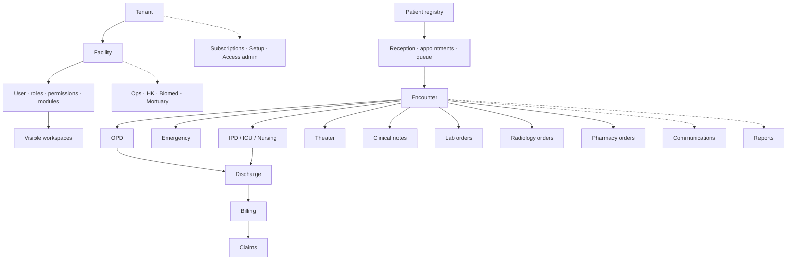
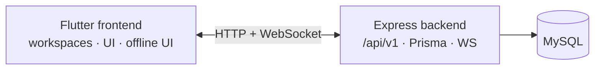

# 01 — Overview

How the app is put together at the highest level.

## Two shells

```mermaid
flowchart LR
  subgraph authShell [Auth shell]
    L[/login]
    R[/register]
    V[/verify-email]
    F[/forgot-password]
    X[/reset-password]
  end

  subgraph appShell [App shell — ResponsiveAppShell]
    SB[Sidebar / rail / drawer]
    HD[Header · account · connectivity · subscription]
    WS[Active workspace page]
  end

  subgraph status [Status pages — no shell]
    SR[/session-restoring]
    AR[/auth-required]
    FB[/forbidden]
  end

  authShell -->|success| appShell
  status --> authShell
  status --> appShell
```

| Piece | Path / widget |
| --- | --- |
| App shell | `ResponsiveAppShell` |
| Auth shell | `AuthShellLayout` |
| Router | `app_router.dart` + `AppRouteGuards` |

## Navigation groups (sidebar)

Same order as the running app:

```mermaid
flowchart TB
  O[Overview] --> H[Home /]
  PA[Patient access] --> R[Reception]
  PA --> P[Patients]
  PA --> OPD[OPD]
  PA --> ED[Emergency]
  IP[Inpatient care] --> IPD[IPD]
  IP --> RB[Rooms & beds]
  IP --> ICU[ICU]
  IP --> NUR[Nursing]
  CS[Clinical services] --> CLI[Clinical]
  CS --> PHY[Physiotherapy]
  CS --> TH[Theater]
  CS --> DIS[Discharge]
  DX[Diagnostics & medication] --> LAB[Lab]
  DX --> RAD[Radiology]
  DX --> PH[Pharmacy]
  RV[Revenue cycle] --> BIL[Billing]
  RV --> CLM[Claims]
  RV --> SUB[Subscriptions]
  FO[Facility operations] --> OPS[Operations]
  FO --> HK[Housekeeping]
  FO --> BIO[Biomedical]
  FO --> MOR[Mortuary]
  AD[Administration] --> HR[HR]
  AD --> COM[Communications]
  AD --> INT[Integrations]
  AD --> REP[Reports]
  AD --> SET[Settings]
  AD --> SUP[Setup]
```



**Also routed (not a sidebar item):** `/admin/access` (Access admin). `/profile` redirects into Settings.

## How pieces interconnect



## Monorepo split



| Layer | Owns |
| --- | --- |
| Frontend feature | Screen + Riverpod + repository DTO |
| Backend module | Routes → controllers → services → Prisma |
| Shared frontend | Shell, dialogs, workflow openers, design system |
| Core frontend | Auth session, permissions, realtime, sync, network |

## Role overlay (simplified)

Nav is filtered by **role ∪ permission ∪ active subscription module**.

| Focused role | Typical visible set |
| --- | --- |
| Lab tech | Home · Patients · Lab · Comms · Settings |
| Pharmacist | Home · Patients · Pharmacy · Comms · Settings |
| Receptionist | Home · Reception · Patients · OPD · Emergency · Comms · Settings |
| Billing | Home · Patients · Billing · Claims · Comms · Reports · Settings |
| Clinician / admin | Broader groups (see access policy) |

Next: [02 Startup, auth & access](02-startup-auth-access.md)
