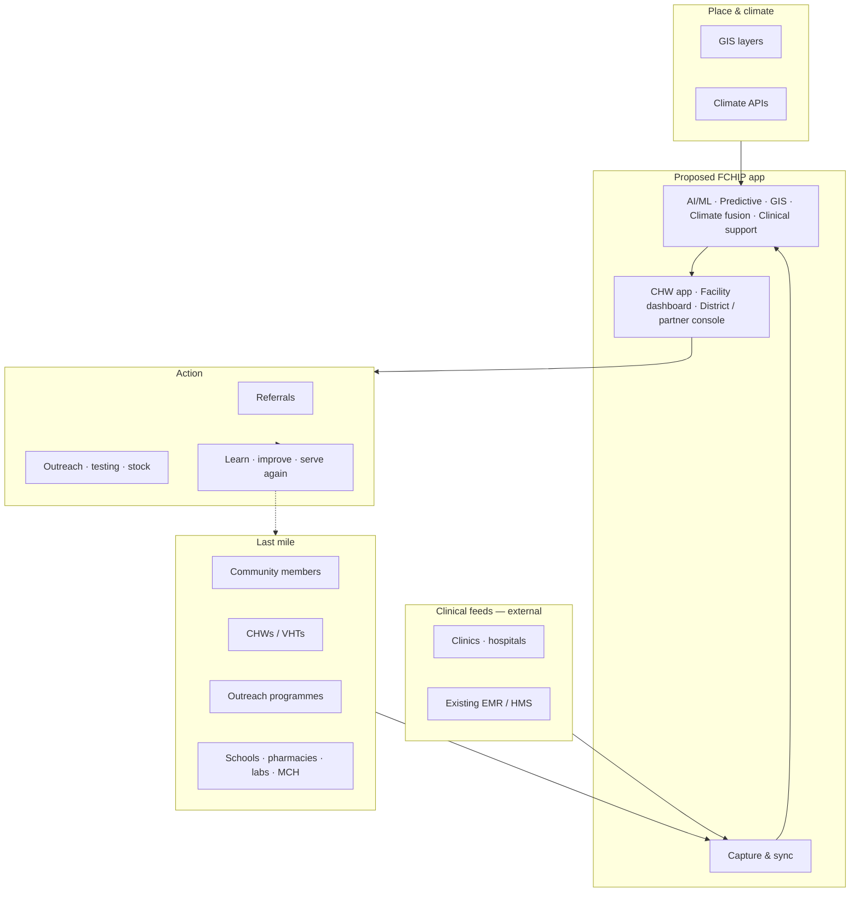
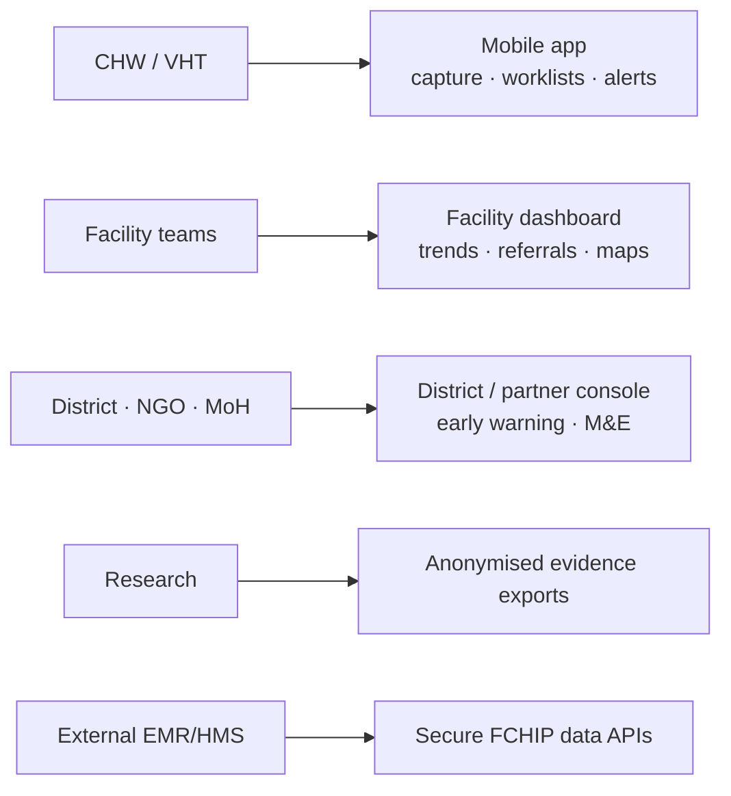

# 01 — Proposed overview

SoT: §1, §4.1, §4.4.

## What FCHIP is

**FCHIP** turns fragmented community and facility health signals into **predictive, climate-aware intelligence**. It powers the cascade **Data & Feedback** loop.

| Is | Is not |
| --- | --- |
| Intelligence platform on the cascade | A hospital / EMR product |
| Connects CHWs, facilities, districts, partners | A replacement for clinic software |
| AI + GIS + climate fusion | Single-purpose booking or SMS tool |

## Proposed big picture



## Who uses which surface



## Theory of change FCHIP supports

```text
Participation → Prevention → Access → Earlier care → Better health → Livelihoods → Learning → Better services
```

Next: [02 Cascade](02-cascade.md)
