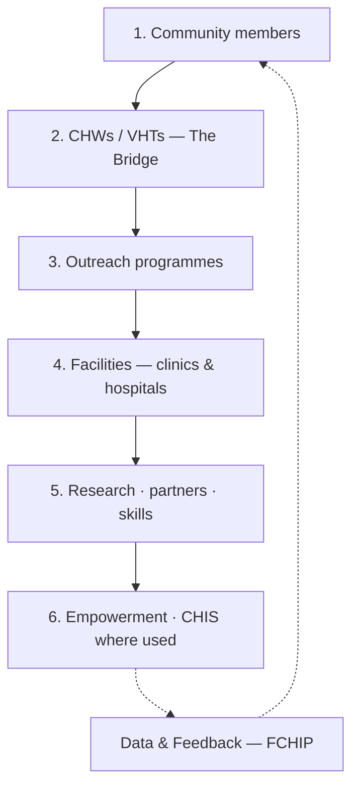
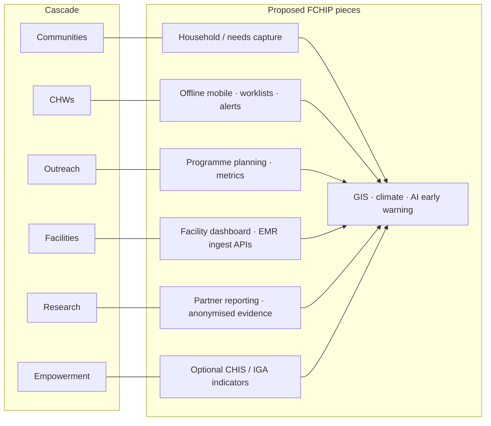
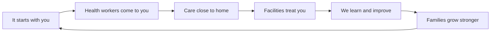
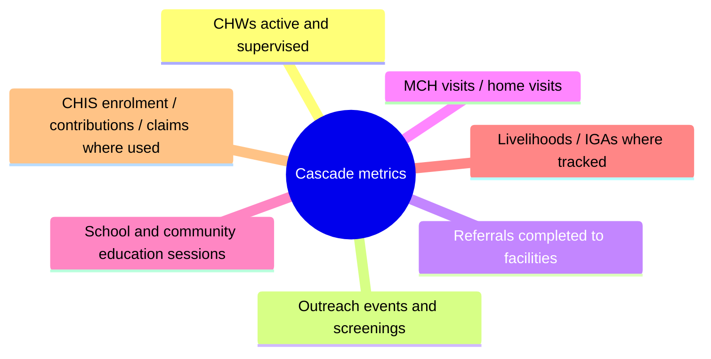

# 02 — Cascade (field context)

SoT: §2. FCHIP digitises and amplifies this — it does not replace it.

## Core cascade (do not reorder)

## Proposed FCHIP role per layer

| Layer | Proposed FCHIP role |
| --- | --- |
| Community members | Capture needs, participation, household signals |
| CHWs / VHTs | Offline mobile tools, worklists, alerts, structured collection |
| Outreach programmes | Planning, screening campaigns, school/community education metrics |
| Facilities | Facility dashboard, referrals, **secure EMR/HMS ingest** (not replace EMR) |
| Research · partners | Anonymised evidence, training analytics, partner reporting |
| Empowerment / CHIS / IGAs | Enrolment, contributions/claims, livelihood-linked access (where data exists) |
| **Data & Feedback** | GIS maps, climate fusion, AI early warning, continuous improvement |

## Community journey (same cascade, plain words)

## Indicators the app should digitise

Next: [03 Architecture](03-architecture.md)
