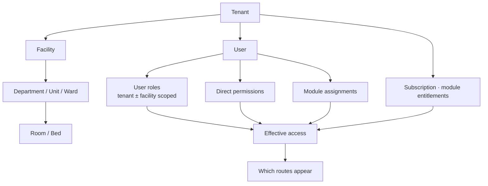
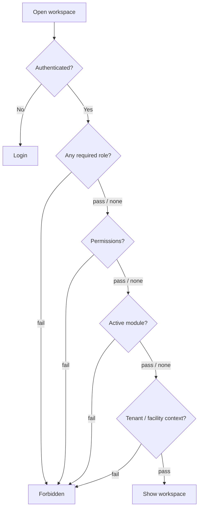

# 02 — Startup, auth & access

## Boot → home

```mermaid
flowchart TD
  M[main.dart] --> B[bootstrap]
  B --> LOAD[StartupLoadingApp]
  LOAD --> INIT[AppStartupInitializer<br/>config · prefs · secure storage · restore session]
  INIT --> APP[FchipApp · MaterialApp.router]
  APP --> SB[SessionBootstrap<br/>refresh token · enrich user]
  SB --> GR{GoRouter redirect}
  GR -->|not ready| SR[/session-restoring]
  GR -->|no session| LOGIN[/login?from=…]
  GR -->|on auth page while signed in| HOME[/]
  GR -->|missing role / permission / module| FORB[/forbidden]
  GR -->|ok| HOME
  HOME --> SHELL[App shell + HomePage]
```

| Step | Key files |
| --- | --- |
| Entry | `frontend/lib/main.dart`, `bootstrap.dart` |
| Startup | `app/startup/app_startup_initializer.dart` |
| Session | `app/startup/session_bootstrap.dart`, `core/security/` |
| Guards | `app/router/route_guards.dart` |

## Auth shell screens

```mermaid
flowchart LR
  LOGIN[/login] --> HOME[/]
  LOGIN --> REG[/register]
  REG --> VER[/verify-email]
  LOGIN --> FORGOT[/forgot-password]
  FORGOT --> RESET[/reset-password]
  RESET --> LOGIN
```

| Route | Page |
| --- | --- |
| `/login` | `LoginPage` |
| `/register` | `RegisterPage` |
| `/verify-email` | `VerifyEmailPage` |
| `/forgot-password` | `ForgotPasswordPage` |
| `/reset-password` | `ResetPasswordPage` |

Logout (header menu): clear session → `/login`.

## Tenancy spine



**Backend gate order (after auth):** authenticate → tenant scope → module entitlement → ABAC.

## Access decision (per route)



Roles live in `AppRole` / Prisma `UserRole` (e.g. `SUPER_ADMIN`, `TENANT_ADMIN`, `FACILITY_ADMIN`, `DOCTOR`, `NURSE`, `LAB_TECH`, `PHARMACIST`, `RECEPTIONIST`, `BILLING`, …).

Next: [03 Care spine](03-care-spine.md)
