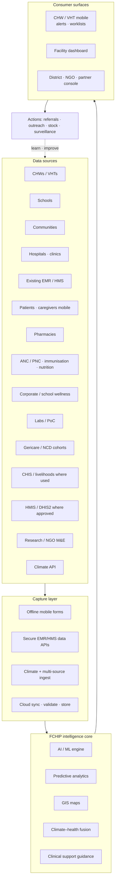
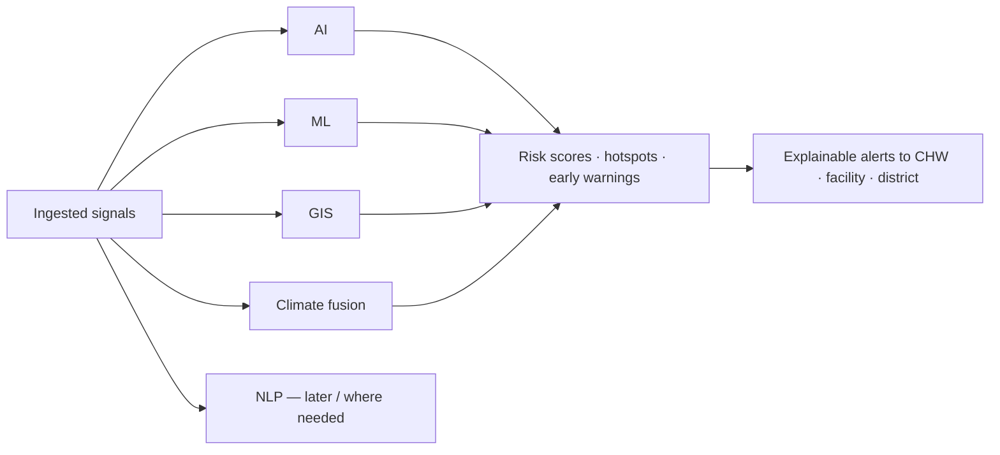
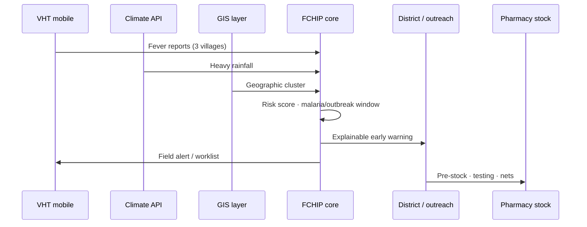

# 03 — Proposed architecture

SoT: §4.2–4.4, §5.

## Layered flow

## Intelligence core (deep tech)

| Technology | Proposed function |
| --- | --- |
| AI | Disease risk, outbreak warning, maternal / NCD scoring |
| ML | Patterns from history, seasons, outreach outcomes |
| GIS | Disease distribution, hotspots, resource gaps |
| Climate APIs | Rainfall, temperature, extremes fused with health |
| Secure EMR/HMS APIs | Real-time clinical share — **do not replace** facility EMR |
| Mobile capture | Offline CHW/VHT structured forms |
| Cloud | Sync across facilities and admin levels |
| Dashboards | Trends, maps, alerts for facilities and districts |
| NLP | Local-language symptom reporting / summarisation where appropriate |

## Early detection path (example)

Next: [04 Modules](04-modules.md)
