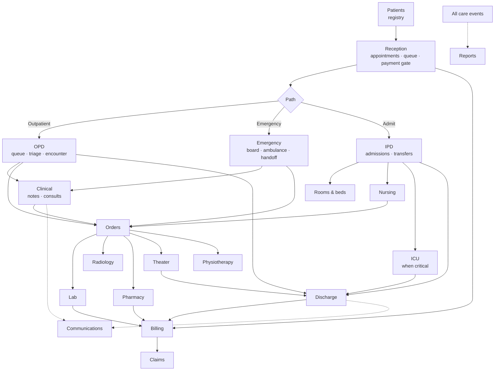
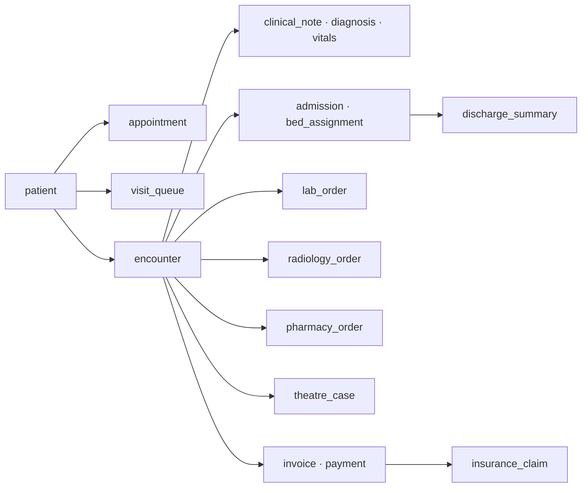
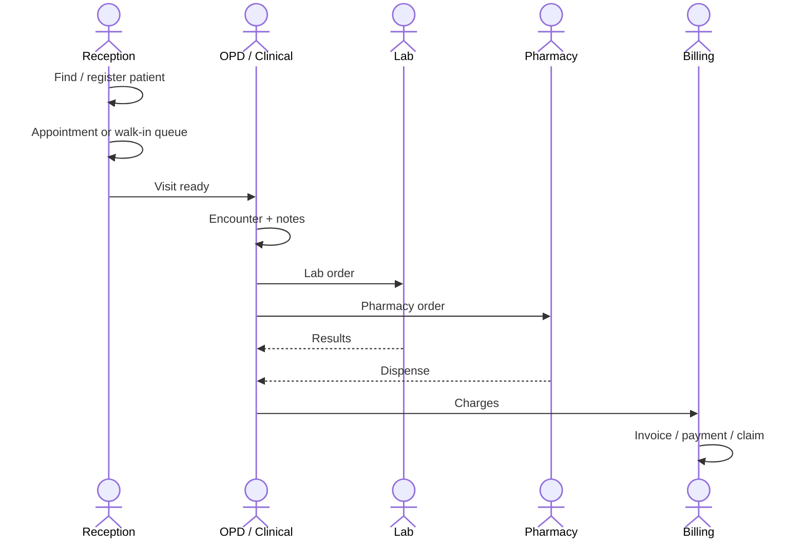
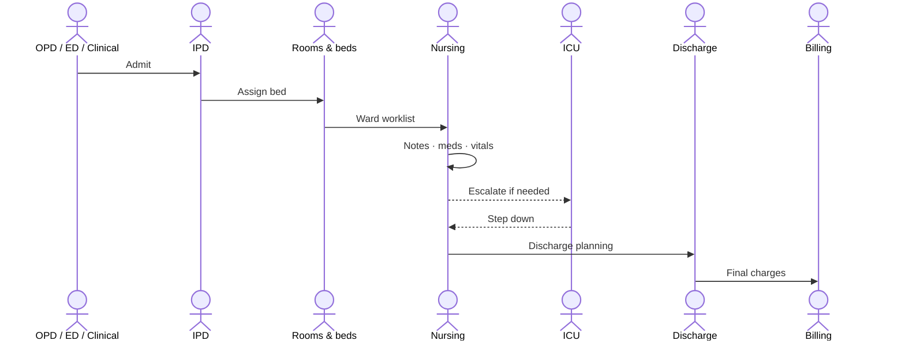
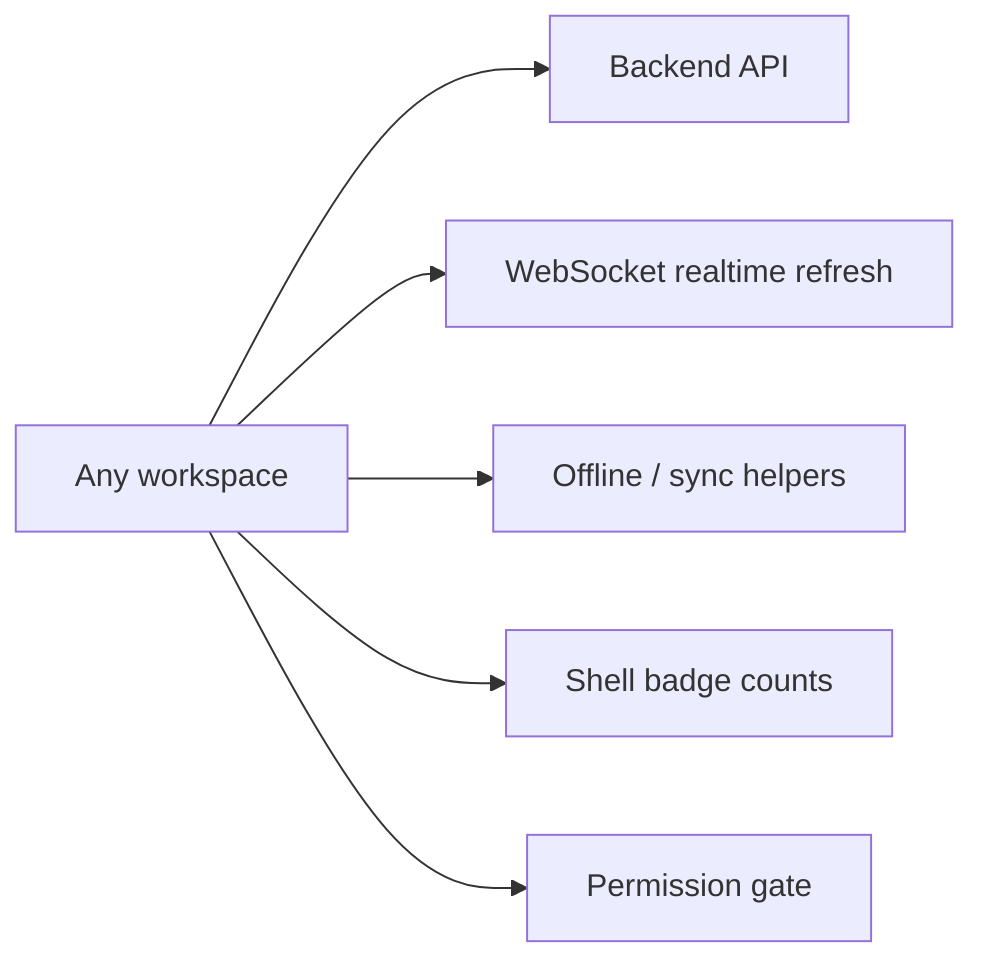

# 03 — Care spine (modules connected)

This is the main **patient path** across workspaces. Shared key: **patient → visit queue / appointment → encounter**.

## End-to-end care flow

## Domain spine (backend)

Flow engines (fat services): `opd-flow`, `ipd-flow`, `theatre-flow`, `therapy-flow`, plus `triage` / `emergency-case`.

## Typical outpatient path

## Typical inpatient path

## Cross-cutting always on

Next: [04 Workspaces](04-workspaces.md)
