# 04 — Proposed modules & screens

SoT: §2.4, §4, §7, §11.1.

These are **proposed product modules** for FCHIP — not the current HIS workspaces in the repo.

## Module map (how they connect)

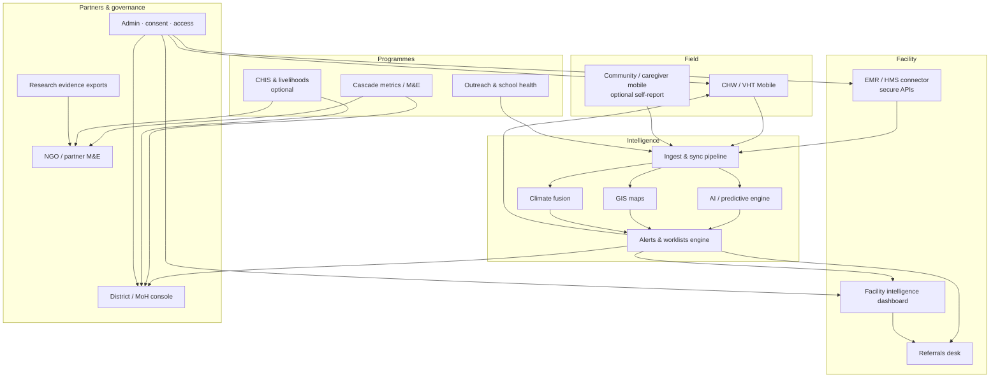

---

## Module details

### 1. CHW / VHT Mobile

**Users:** Community Health Workers / Village Health Teams  

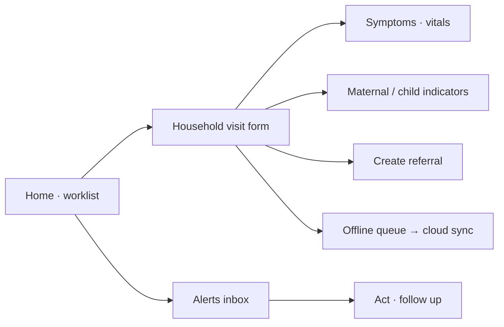

| Screens (proposed) | Job |
| --- | --- |
| Worklist | Today’s visits, follow-ups, alert tasks |
| Visit / form | Offline structured capture |
| Referral | Send household to facility; track completion |
| Alerts | Risk flags from intelligence core |
| Sync status | Offline queue health |

**Connects to:** Ingest pipeline · Alerts engine · Referrals desk · Cascade metrics  

---

### 2. Community / caregiver mobile (optional)

**Users:** Patients / caregivers (where used)  

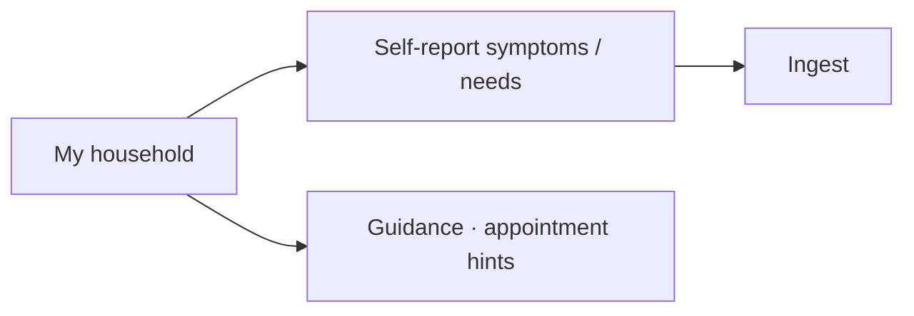

**Connects to:** Ingest · CHW follow-up worklists  

---

### 3. Outreach & school health

**Users:** Programme managers, CHW supervisors  

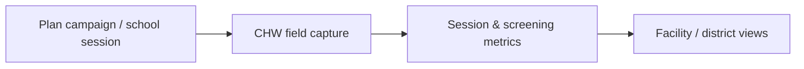

| Screens | Job |
| --- | --- |
| Campaign planner | Outreach, screening, school health |
| Session log | Attendance, topics, outcomes |
| Coverage map | Where programmes ran |

**Connects to:** CHW mobile · Cascade metrics · GIS  

---

### 4. Cascade metrics / M&E

**Users:** Programme managers, NGOs, districts  

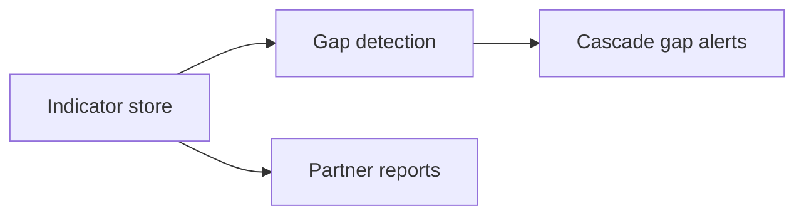

Tracks SoT indicators: active CHWs, outreach, completed referrals, MCH visits, education sessions, optional CHIS/IGA.

**Connects to:** All capture modules · District / NGO consoles · AI cascade-gap use case  

---

### 5. CHIS & livelihoods (optional)

**Users:** Partners who run financial protection / IGAs  

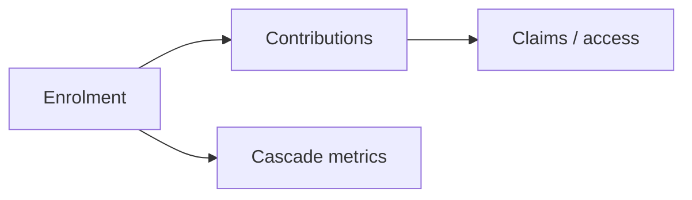

**Not** core product identity — programme intelligence only.

---

### 6. Facility intelligence dashboard

**Users:** Clinics, medical centres (population health view)  

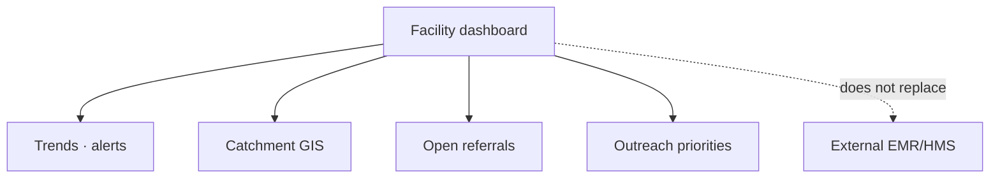

| Screens | Job |
| --- | --- |
| Overview | Alerts, caseload risk, cascade gaps |
| Map | Village/parish hotspots + climate overlay |
| Referrals | Inbound from CHWs; completion |
| Stock signal | Demand forecast hints (links to pharmacy partners) |

**Connects to:** EMR connector · Alerts · GIS · Referrals · District console  

---

### 7. Referrals desk

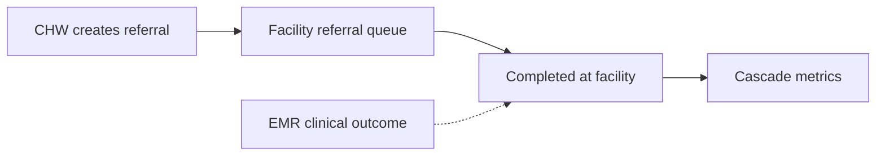

---

### 8. EMR / HMS connector

**External systems push/sync into FCHIP** — authenticated, consent-aware, least privilege.

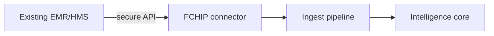

FCHIP **does not** become the hospital EMR.

---

### 9–13. Intelligence stack (shared services)

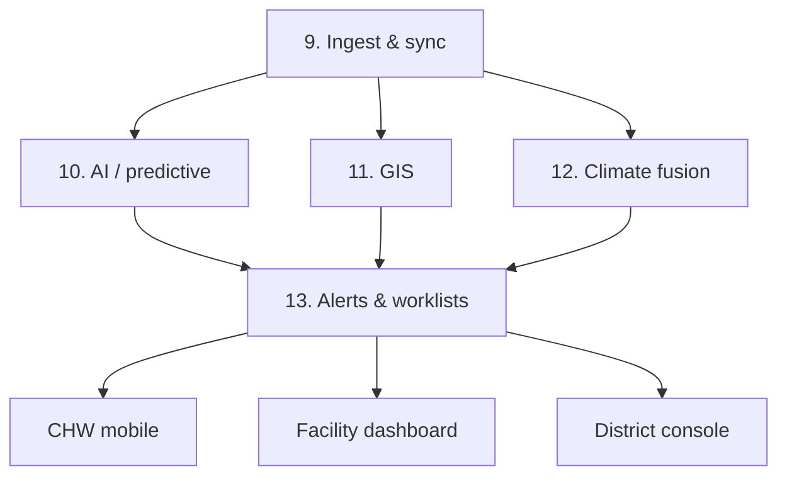

---

### 14. District / MoH console

**Users:** District health offices, ministries  

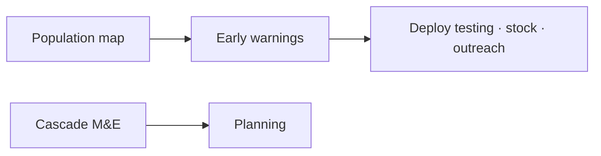

---

### 15. NGO / partner M&E

Real-time programme monitoring, impact evidence, optimisation — same metrics spine, partner-scoped.

---

### 16. Research evidence exports

Anonymised datasets for approved research — no raw PHI dumps.

---

### 17. Admin · consent · access

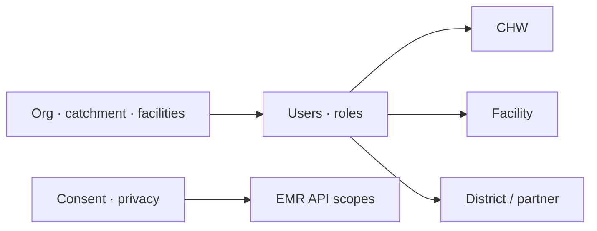

---

## User → module matrix

| User (SoT §7) | Primary modules |
| --- | --- |
| CHW / VHT | Mobile, Alerts, Referrals |
| Medical centres & clinics | Facility dashboard, Referrals, EMR connector |
| District health offices | District console, GIS, Alerts, Cascade metrics |
| NGOs & partners | Partner M&E, Cascade metrics, Outreach |
| Ministries of health | District/national console, early warning |
| Insurance companies | Population insights (prevention-focused) |
| Research institutions | Evidence exports |

Next: [05 Use cases](05-use-cases.md)
