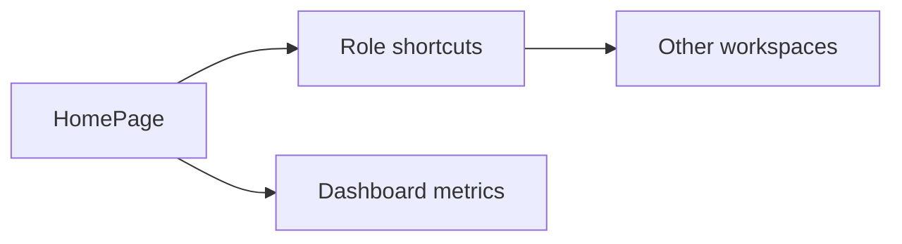
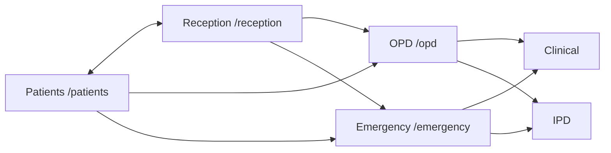
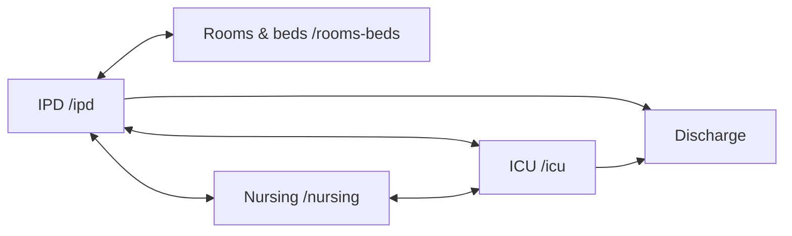
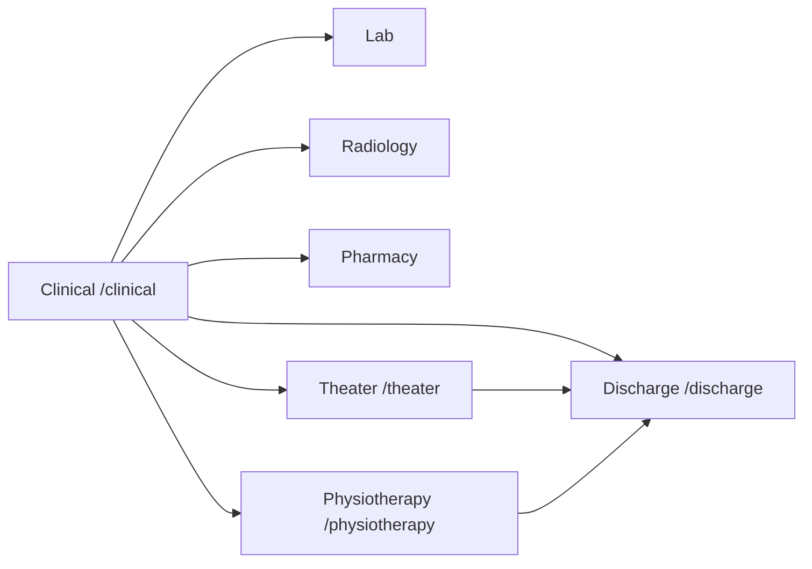
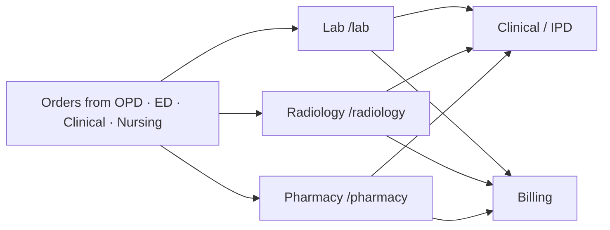
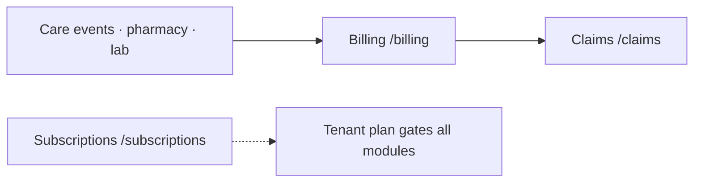
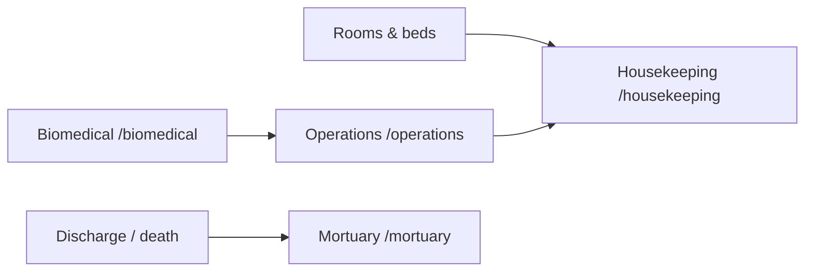
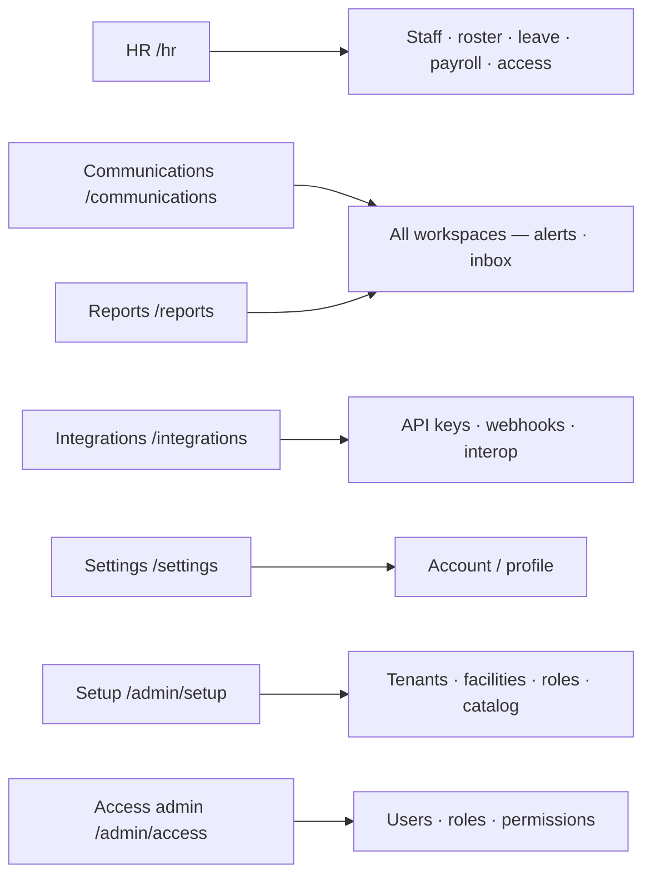

# 04 — Workspaces (each screen)

Every app-shell workspace: **route → job → connects to**.

Feature code: `frontend/lib/features/<name>/`.

---

## Overview

### Home — `/`

| | |
| --- | --- |
| **Job** | Role-aware landing; jump into work queues |
| **Connects to** | Any workspace the user can open |
| **Feature** | `home` |

---

## Patient access

| Workspace | Route | Page | Job | Neighbours |
| --- | --- | --- | --- | --- |
| **Reception** | `/reception` | `ReceptionWorkspacePage` | Appointments, queue, visits, payment gate | Patients, OPD, Emergency, Billing |
| **Patients** | `/patients` | `PatientRegistryPage` | Master patient registry | Reception, all clinical desks |
| **OPD** | `/opd` | `OpdWorkspacePage` | Outpatient queue, triage, encounters | Reception, Clinical, Lab, Pharmacy, IPD |
| **Emergency** | `/emergency` | `EmergencyWorkspacePage` | ED board, ambulance, handoff | Reception, Clinical, IPD, ICU |

---

## Inpatient care

| Workspace | Route | Page | Job | Neighbours |
| --- | --- | --- | --- | --- |
| **IPD** | `/ipd` | `IpdWorkspacePage` | Admissions, bed board, transfers | Rooms & beds, Nursing, ICU, Clinical, Discharge |
| **Rooms & beds** | `/rooms-beds` | `RoomsBedsWorkspacePage` | Capacity and turnover | IPD, Housekeeping |
| **ICU** | `/icu` | `IcuWorkspacePage` | Critical patients / beds | IPD, Nursing, Clinical |
| **Nursing** | `/nursing` | `NursingWorkspacePage` | Ward worklists, nursing detail | IPD, ICU, Pharmacy, Clinical |

---

## Clinical services

| Workspace | Route | Page | Job | Neighbours |
| --- | --- | --- | --- | --- |
| **Clinical** | `/clinical` | `ClinicalWorkspacePage` | Documentation / consults | OPD, IPD, Lab, Rad, Pharmacy, Theater |
| **Physiotherapy** | `/physiotherapy` | `PhysiotherapyWorkspacePage` | Rehab queue (admin-gated module) | Clinical, Discharge |
| **Theater** | `/theater` | `TheaterWorkspacePage` | OR schedule, checklist, anesthesia | Clinical, IPD, Pharmacy |
| **Discharge** | `/discharge` | `DischargeWorkspacePage` | Planning and clearances | IPD, Nursing, Billing, Clinical |

---

## Diagnostics & medication

| Workspace | Route | Page | Job | Neighbours |
| --- | --- | --- | --- | --- |
| **Lab** | `/lab` | `LabWorkspacePage` | Worklist → sample → result → verify | Clinical, OPD, IPD, Billing |
| **Radiology** | `/radiology` | `RadiologyWorkspacePage` | Imaging worklist / reporting | Clinical, OPD, IPD, Billing |
| **Pharmacy** | `/pharmacy` | `PharmacyWorkspacePage` | Dispense queue + catalog | Clinical, Nursing, Billing |

---

## Revenue cycle

| Workspace | Route | Page | Job | Neighbours |
| --- | --- | --- | --- | --- |
| **Billing** | `/billing` | `BillingWorkspacePage` | Invoices / payments queues | Reception, Discharge, Claims, Patients |
| **Claims** | `/claims` | `ClaimsWorkspacePage` | Insurance claims desk | Billing, Patients |
| **Subscriptions** | `/subscriptions` | `SubscriptionsWorkspacePage` | Platform plans (super-admin) | Setup, whole shell entitlements |

---

## Facility operations

| Workspace | Route | Page | Job | Neighbours |
| --- | --- | --- | --- | --- |
| **Operations** | `/operations` | `OperationsWorkspacePage` | Facility maintenance requests | Housekeeping, Biomedical |
| **Housekeeping** | `/housekeeping` | `HousekeepingWorkspacePage` | Tasks, schedules, maintenance | Rooms & beds, Operations |
| **Biomedical** | `/biomedical` | `BiomedicalWorkspacePage` | Equipment suite | Operations, clinical units |
| **Mortuary** | `/mortuary` | `MortuaryWorkspacePage` | Mortuary cases | Discharge, Clinical |

---

## Administration

| Workspace | Route | Page | Job | Neighbours |
| --- | --- | --- | --- | --- |
| **HR** | `/hr` | `HrWorkspacePage` | Staff, leave, roster, payroll, access | Setup, Access admin |
| **Communications** | `/communications` | `CommunicationsWorkspacePage` | Inbox, notifications, templates | Header shortcut; all desks |
| **Integrations** | `/integrations` | `IntegrationsWorkspacePage` | API keys, webhooks, interop | Setup, external systems |
| **Reports** | `/reports` | `ReportsWorkspacePage` | Analytics / compliance panels | All care + billing data |
| **Settings** | `/settings` | `SettingsPage` | App + account settings | Profile redirect target |
| **Setup** | `/admin/setup` | `TenantFacilitySetupPage` | Tenants, facility structure, roles, catalog | Access admin, Subscriptions |
| **Access admin** | `/admin/access` | `AccessAdminWorkspacePage` | Users / roles / permissions | Setup, HR *(no sidebar item)* |

---

## Auth pages (no app shell)

| Route | Page |
| --- | --- |
| `/login` | `LoginPage` |
| `/register` | `RegisterPage` |
| `/verify-email` | `VerifyEmailPage` |
| `/forgot-password` | `ForgotPasswordPage` |
| `/reset-password` | `ResetPasswordPage` |
| `/session-restoring` | `SessionRestoringPage` |
| `/auth-required` | `AuthRequiredPage` |
| `/forbidden` | `ForbiddenPage` |

---

## Full route checklist

| Path | Name |
| --- | --- |
| `/` | home |
| `/reception` | reception |
| `/patients` | patients |
| `/opd` | opd |
| `/emergency` | emergency |
| `/ipd` | ipd |
| `/rooms-beds` | roomsBeds |
| `/icu` | icu |
| `/nursing` | nursing |
| `/clinical` | clinical |
| `/physiotherapy` | physiotherapy |
| `/theater` | theater |
| `/discharge` | discharge |
| `/lab` | lab |
| `/radiology` | radiology |
| `/pharmacy` | pharmacy |
| `/billing` | billing |
| `/claims` | claims |
| `/subscriptions` | subscriptions |
| `/operations` | operations |
| `/housekeeping` | housekeeping |
| `/biomedical` | biomedical |
| `/mortuary` | mortuary |
| `/hr` | hr |
| `/communications` | communications |
| `/integrations` | integrations |
| `/reports` | reports |
| `/settings` | settings |
| `/admin/setup` | tenantFacilitySetup |
| `/admin/access` | accessAdmin |
| `/profile` | → settings account |

Next: [05 Platform](05-platform.md)
