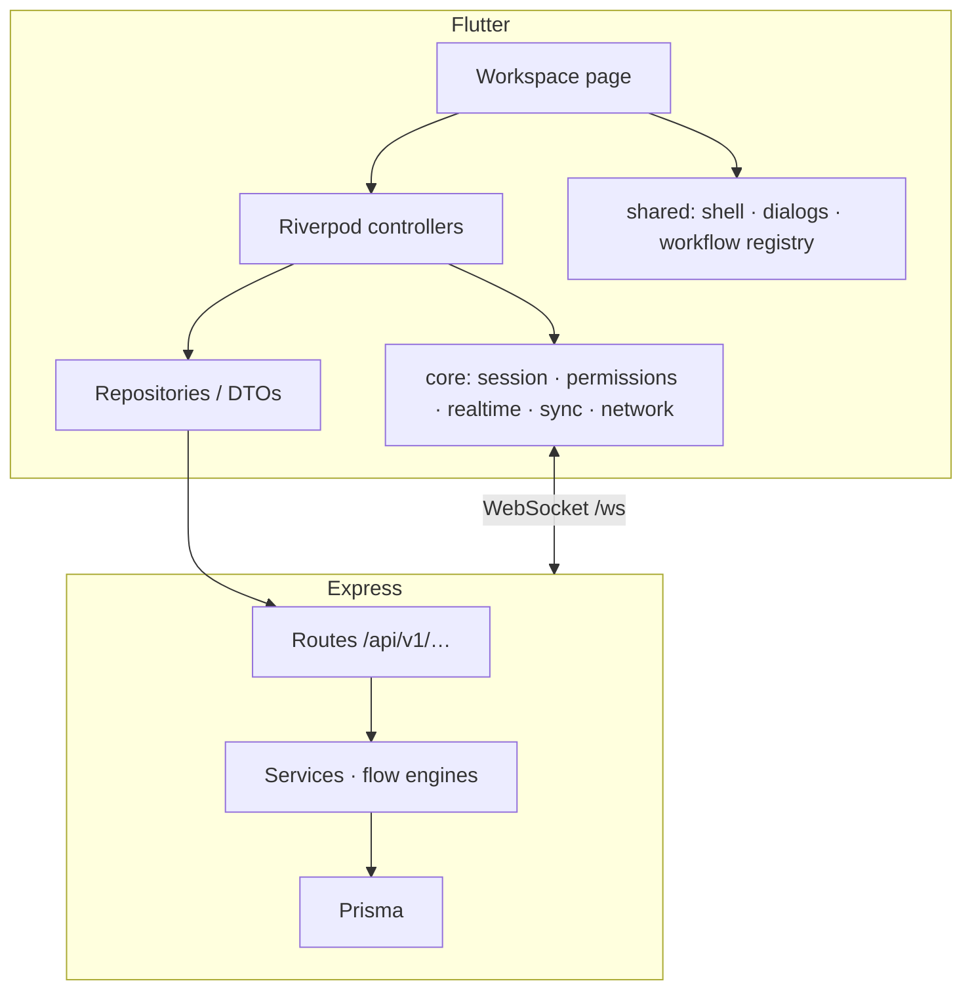
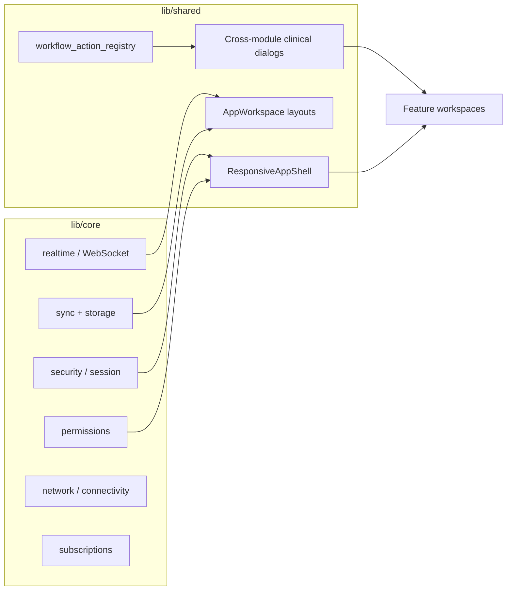
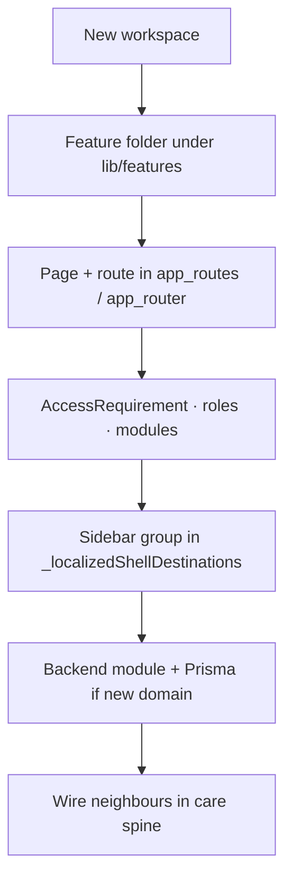

# 05 — Platform connections

How frontend workspaces sit on backend domains and shared glue.

## Frontend ↔ backend



## Backend domain map (grouped)

```mermaid
flowchart TB
  subgraph access [Access & place]
    auth
    tenant
    facility
    user
    role
    permission
    abac
  end

  subgraph patient [Patient]
    patient
    appointment
    visit_queue
    encounter
  end

  subgraph flows [Flow engines]
    opd_flow
    ipd_flow
    theatre_flow
    therapy_flow
    triage
    emergency_case
  end

  subgraph dx [Diagnostics & pharmacy]
    lab_workspace
    radiology_workspace
    pharmacy_workspace
  end

  subgraph money [Revenue]
    billing
    claims_workspace
    subscriptions_workspace
  end

  access --> patient --> flows
  flows --> dx
  flows --> money
```

Many smaller CRUD modules hang under these hubs (notes, vitals, orders, invoices, HR, housekeeping, etc.). Full list: `backend/src/modules/` (mounted in `backend/src/app/router.js`).

## Shared glue (always between modules)



| Concern | What it does for every workspace |
| --- | --- |
| **Session** | Tokens, restore, logout |
| **Permissions** | Hide/disable routes and actions |
| **Realtime** | Live list/detail refresh over `/ws` |
| **Offline** | Queue / ETag / idempotency patterns |
| **Workflow registry** | Open the right dialog/route from another desk |
| **Badges** | Sidebar workload counts |

## Adding a new piece (adapt)



Keep the **care spine** stable: patient → queue/encounter → orders → discharge → billing.

← [04 Workspaces](04-workspaces.md) · [Index](README.md)
