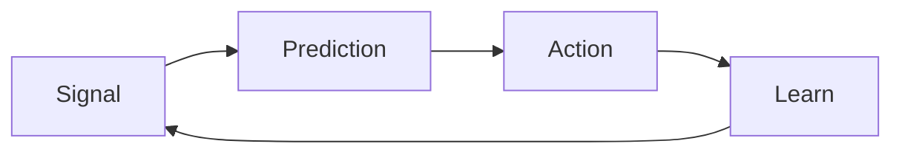
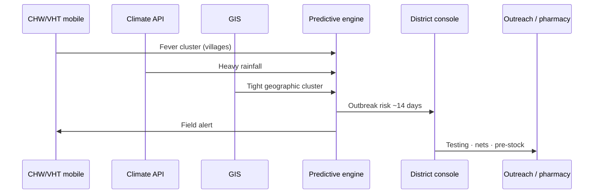
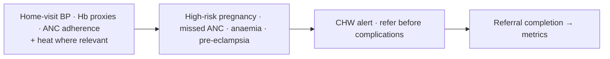
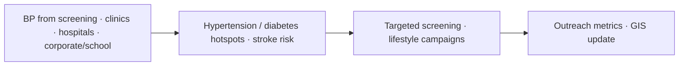
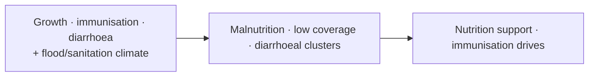
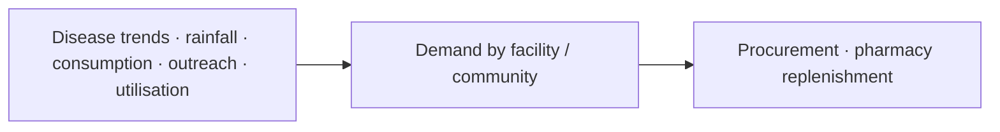
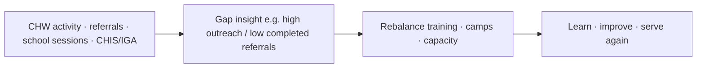
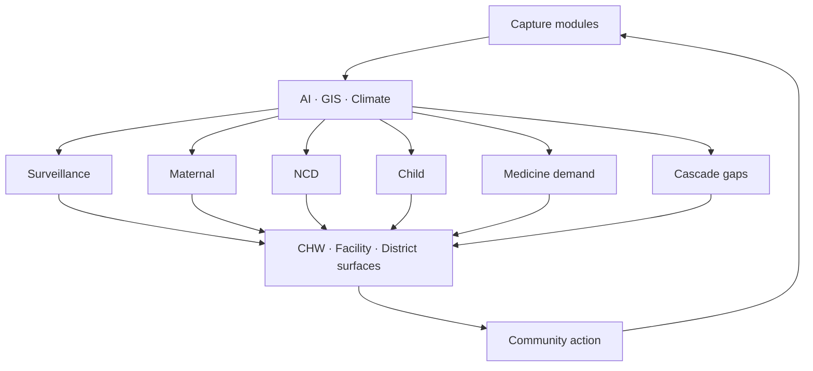

# 05 — Proposed use-case flows

SoT: §6. Same pattern: **Signal → Prediction → Action → Learn**.

## 1. Disease surveillance (climate-aware)

## 2. Maternal health

**Modules:** CHW mobile · Alerts · Referrals · Facility dashboard · Climate (optional)

## 3. NCDs

**Modules:** Outreach · Facility dashboard · GIS · Ingest (EMR + field)

## 4. Child health

**Modules:** CHW mobile · School health · Climate · District console

## 5. Medicine demand forecasting

**Modules:** Facility dashboard · District console · Climate · Ingest

## 6. Cascade / loop metrics

**Modules:** Cascade metrics · District / NGO consoles · Admin

## Cross-use-case wiring

Next: [06 MVP phases](06-mvp-phases.md)
