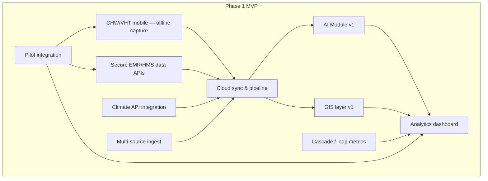
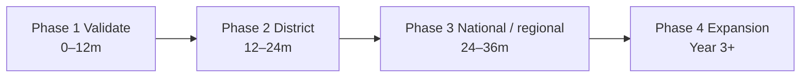
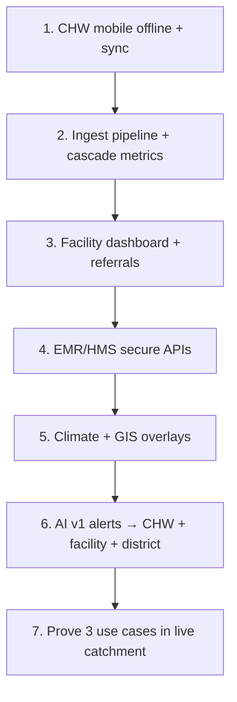

# 06 — MVP & phases

SoT: §11.

## MVP components (proposed build set)

| MVP piece | Feeds | Surfaces |
| --- | --- | --- |
| CHW/VHT mobile | Visits, vitals, MCH, referrals | Field worklists / alerts |
| Multi-source ingest | School, community, hospital, clinic signals | Pipeline |
| Secure EMR/HMS APIs | Clinical push/sync | Pipeline (not an EMR UI) |
| Cascade metrics | CHW, outreach, referrals, school; CHIS/IGA later | Dashboards |
| Cloud sync | Field + EMR + climate | Core store |
| Climate API | Rainfall, temperature, extremes | Fusion / alerts |
| Analytics dashboard | Trends, alerts, maps, gaps | Facility / programme |
| AI Module v1 | Rule + ML-assisted risk scoring | Alerts |
| GIS layer v1 | Cases, climate overlays, risk zones | Maps |
| Pilot integration | Live catchment workflows | End-to-end loop |

## Phase roadmap

| Phase | Ship / prove |
| --- | --- |
| **1 Validate** | CHW mobile + GIS + climate + EMR APIs; ≥3 use cases + cascade metrics; alert accuracy |
| **2 District** | Partner facilities; broader EMR onboarding; NGO M&E; optional CHIS dashboards |
| **3 National / regional** | Multi-district Uganda; East Africa; advanced ML; medicine demand forecasting |
| **4 Expansion** | Clinical decision support; NLP; research modules; optional extras |

## Recommended build order (simple)

## Adapt without breaking the product

1. Keep cascade order fixed.  
2. Keep `CAPTURE → FUSE → PREDICT → ALERT → ACT → LEARN`.  
3. Add sources into **ingest**, not as a new product identity.  
4. Add consumers as **surfaces** on the same alerts/metrics spine.  
5. Never replace EMR/HMS — only connect.

← [05 Use cases](05-use-cases.md) · [Index](README.md)
