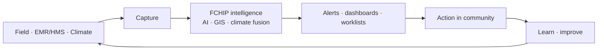

# FCHIP proposed app flows

**Proposed** product flows for the FCHIP app — derived only from [`.cursor/app-write-up.mdc`](../.cursor/app-write-up.mdc).

These diagrams describe **what FCHIP should be**, not the current `backend/` / `frontend/` hospital HIS code. If a diagram and the SoT disagree, **the SoT wins**.

## Master loop

```text
CAPTURE → FUSE → PREDICT → ALERT → ACT → LEARN
```



## Read order

| # | Doc | Shows |
| --- | --- | --- |
| 1 | [01-overview.md](01-overview.md) | Proposed product overview and interconnection |
| 2 | [02-cascade.md](02-cascade.md) | Community health cascade FCHIP serves |
| 3 | [03-architecture.md](03-architecture.md) | Capture → core → consumers |
| 4 | [04-modules.md](04-modules.md) | Proposed modules / screens and how they connect |
| 5 | [05-use-cases.md](05-use-cases.md) | Signal → prediction → action flows |
| 6 | [06-mvp-phases.md](06-mvp-phases.md) | MVP pieces and roadmap phasing |

## Positioning guards (from SoT)

- FCHIP = Community Health Intelligence Platform  
- **Not** a hospital brand or generic EMR/HMS — it **interoperates** with EMR/HMS via secure APIs  
- Cascade order is fixed: communities → CHWs/VHTs → outreach programmes → facilities → research/partners → empowerment  
- CHIS is an **optional** data domain, not core product identity  

Slogan: **Your health, our mission.**
