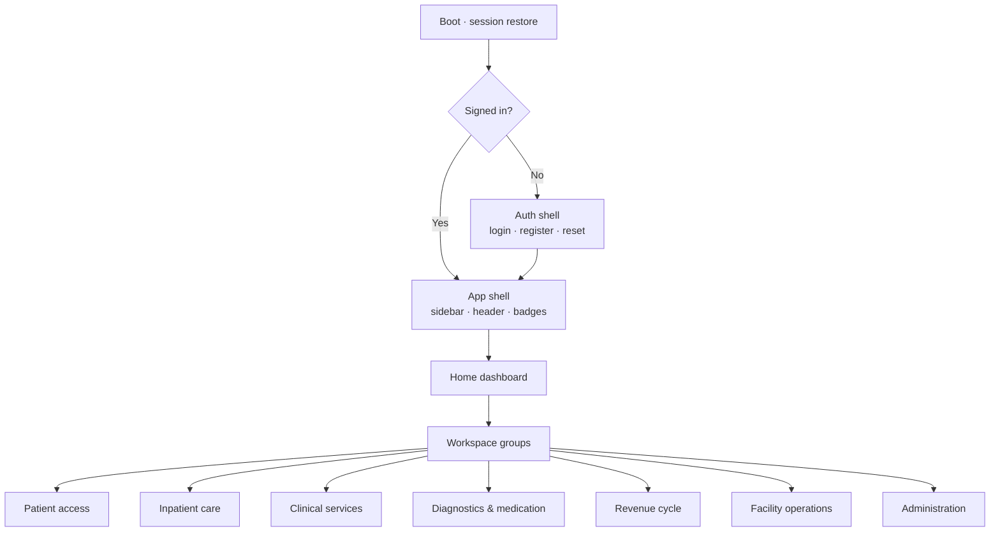

# FCHIP app flows

Flow charts of **how the running app works** — screens, modules, and how they connect.

Built from the Flutter shell (`frontend/lib/app/router/`) and facility modules (`frontend/lib/features/`). Product narrative SoT remains [`.cursor/app-write-up.mdc`](../.cursor/app-write-up.mdc).

## Start here



## Read order

| # | Doc | What you’ll see |
| --- | --- | --- |
| 1 | [01-overview.md](01-overview.md) | Shells, nav map, how everything interconnects |
| 2 | [02-startup-auth-access.md](02-startup-auth-access.md) | Boot → login → roles → route gates |
| 3 | [03-care-spine.md](03-care-spine.md) | Patient journey across modules |
| 4 | [04-workspaces.md](04-workspaces.md) | Each workspace: route, job, neighbours |
| 5 | [05-platform.md](05-platform.md) | Backend domains + realtime / offline / shared glue |

## One-line care spine

```text
Patient → Reception / Queue → Encounter (OPD · ED · IPD · ICU · Theatre)
  → Lab / Radiology / Pharmacy → Discharge → Billing / Claims
```

## Source files

- Routes: `frontend/lib/app/router/app_routes.dart`, `app_router.dart`
- Features: `frontend/lib/features/*`
- API modules: `backend/src/modules/*`
